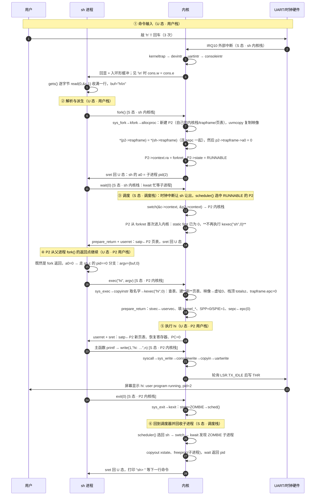
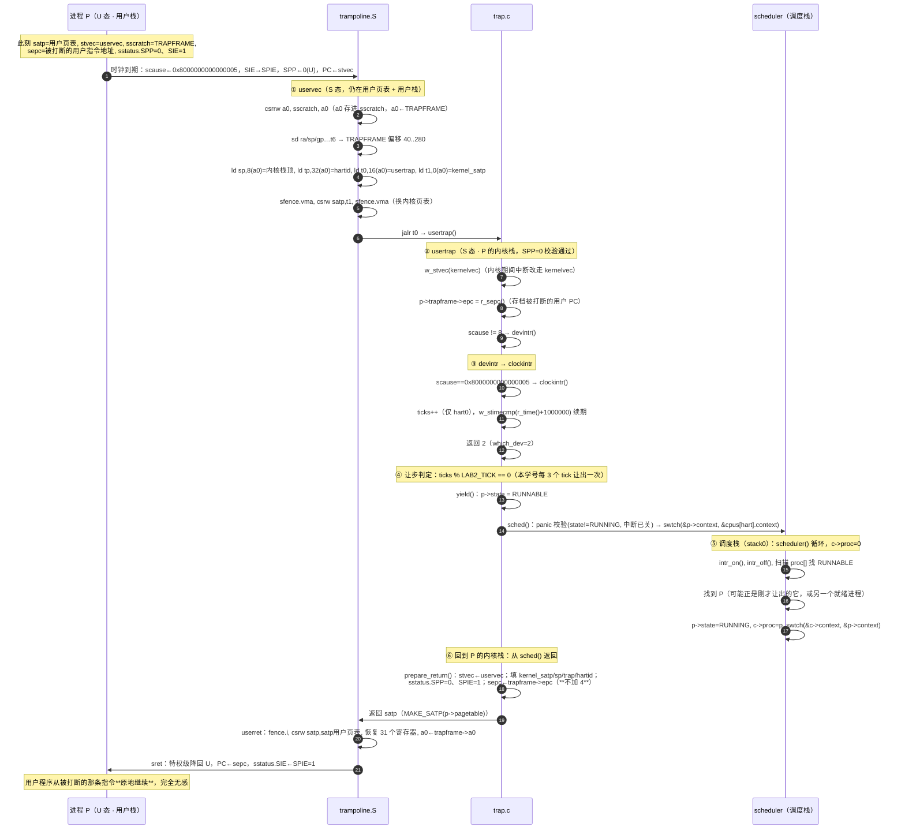
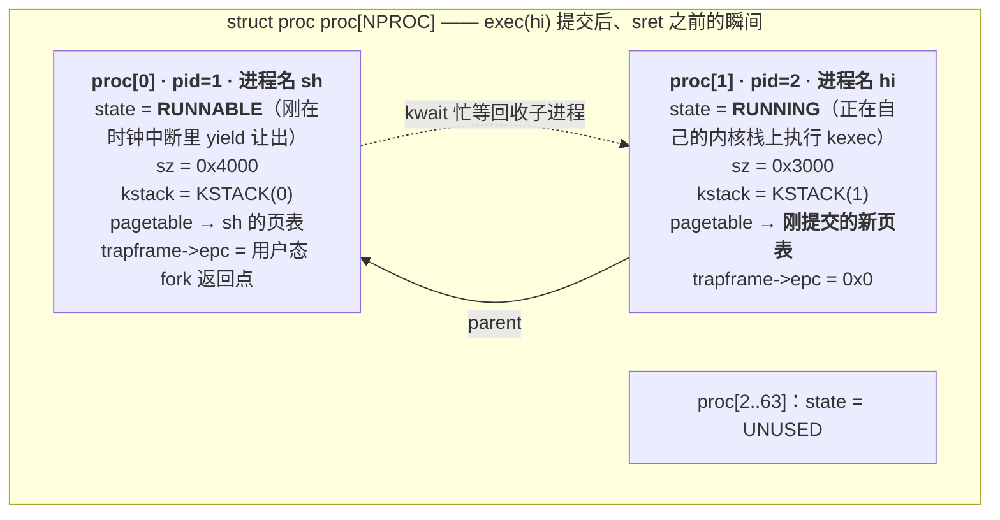
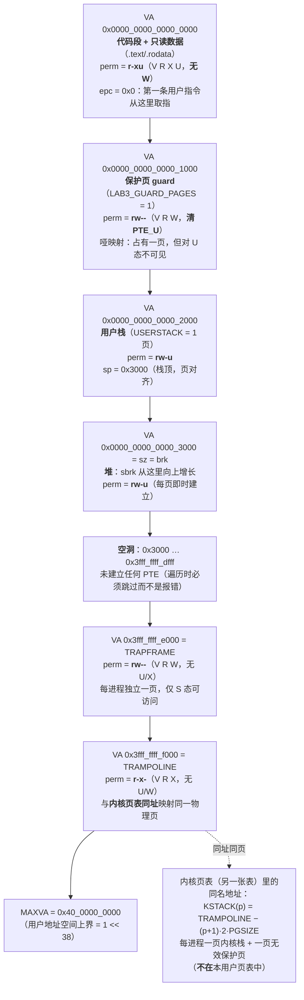
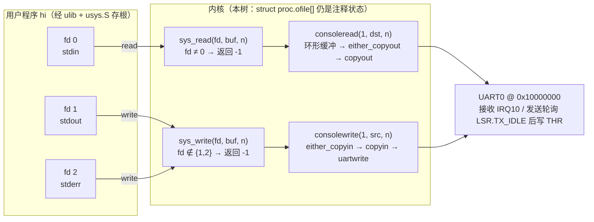

# lab0 设计图纸（三张系统图 · 2026–2027 学期）

> 学号 2024302111292 · 图纸对应本工程 lab2/lab3 已落地的实现（`kexec` + SV39 三级页表）
> 图例约定：**[U]** = 用户态，**[S]** = 监督态，**[M]** = 机器态；每个节点标注运行所在的栈。
> 三张栈：`用户栈` / `内核栈(Px)` = 该进程私有内核栈 `KSTACK(p)` / `调度栈` = hart 0 的 `stack0`（`main()`→`scheduler()` 一直用它）。

**与 lab0 任务书的对应关系**

| 任务书要求的三张图纸 | 本文档位置 | 形式 |
| --- | --- | --- |
| 任务一：`echo hi` 系统控制流图（特权级 / 栈 / 切换触发源） | [图 1](#图-1全系统控制流图模块级) | Mermaid `sequenceDiagram` + 逐节点明细表 |
| 任务二：`exec` 完成瞬间的**数据结构快照**（进程表 / 地址空间与页表 / 文件描述符） | [图 3](#图-3exec-完成瞬间的数据结构快照任务二) | Mermaid `flowchart` + 快照表 |
| 任务三：时钟中断与上下文切换时序（保存现场 → 调度中转 → 恢复现场） | [图 2](#图-2一次时钟中断的微观旅程) | Mermaid `sequenceDiagram` + CSR 快照表 |
| 自检证据（`-d int` 切片 / 插桩输出 / `procdump` / 页表 dump） | [附录 A](#附录-a自检证据实测摘录) | 实测摘录 |

> 交付形态说明：任务书要求图纸以 PNG/SVG/PDF 或清晰手绘件存放于工程目录 `doc/lab0/`。本文档是图纸的 **Mermaid 源**，导出后放入 `doc/lab0/`（同一份源便于随代码演进同步修订）。
> 与 lab3 的衔接：图 3 的地址空间快照已按 lab3 的最终实现标注 **PTE 权限位（`r-xu` / `rw-u` / `rw--` / `r-x-`）** 与**跳板页同址映射**，可直接作为 lab3 加分项要求的"修正后的 lab0 图纸"出示。


---

## 图 1：全系统控制流图（模块级）

**场景**：用户敲下回车，shell 解析出命令 `hi`，装载并运行它，屏幕打出 `hi: user program running, pid=2`，最后回到 `sh>` 提示符。

> 与 lab0 原稿的对应关系：lab0 图上写作 `exec(echo)`、`echo: write(1,"hi")`；本工程 lab2 的等价物是内嵌程序 **`hi`**（`user/hi.c`）——`exec` 的搜索对象是内核里的 `_uprog_table`（lab6 才换成真文件系统），`echo` 这一格由 `hi` 承担，其余链路完全一致。

### 1.1 时序全景



> **容易画错的一点（本图已按代码修正）**：`forkret` 不是"fork 子进程的入口"，而是**所有被调度进程第一次被 `swtch` 选中时的统一落点**（`allocproc` 把 `p->context.ra` 设成它）。其中装载 `sh` 的 `kexec("sh", 0)` 被 `static int first` 守着，**只有系统里的第一个进程会执行**；`fork` 出来的子进程进来时 `first` 已是 0，于是只做 `prepare_return()`，从**父进程 `fork()` 的返回点**以 `a0=0` 回到用户态，再由 `sh.c` 的 `pid == 0` 分支发起 `exec("hi", argv)`。图 1 里 P2 的"装载"因此发生在 **exec 系统调用**里，而不是 `forkret` 里。

> **📌 批注 ②（对应思考题 2：`fork` 的单次调用、双重返回值）——挂在图 1 的 `fork` 节点上**
>
> 分歧点是两类"返回值"落在**同一个寄存器 `a0`** 上，但写入者不同：
>
> - **子进程**：`kfork` 整块复制父进程现场（[proc.c:279](../../kernel/proc.c#L279) `*(np->trapframe) = *(p->trapframe);`），紧接着把子进程的 `trapframe->a0` 改成 0（[proc.c:282](../../kernel/proc.c#L282) `np->trapframe->a0 = 0;`）。子进程第一次返回用户态走 `forkret → userret`，`userret` 从 TRAPFRAME 恢复 `a0`，于是拿到 **0**。
> - **父进程**：`kfork` 正常返回 `np->pid`，系统调用分发处把它写进**自己的** `trapframe->a0`（[syscall.c:120](../../kernel/syscall.c#L120) `p->trapframe->a0 = syscalls[num]();`），`userret` 恢复后拿到 **子进程 pid**。
>
> 机理落在 RISC-V 调用约定上：**函数返回值放在 `a0`**。内核不是"把返回值返回给用户"，而是把 `a0` 写进"这个进程下次返回用户态时要恢复的寄存器现场"（trapframe）。父子各自有独立的 trapframe，所以同一条 `ecall` 在两边恢复出不同的 `a0`。


### 1.2 逐节点明细（栈 / 特权级 / 代码位置 / 寄存器）

| # | 阶段 | 栈 | 特权级 | 代码路径与关键动作 |
| --- | --- | --- | --- | --- |
| 1 | 键盘产生中断 | — | M→S | UART 拉高 IRQ10；PLIC 优先级 1 > 阈值 0；`sie.SEIE` 已开 |
| 2 | 中断入口 | **sh 内核栈** | S | 被打断的是 S 态代码（`consoleread` 忙等中），`stvec=kernelvec` → 压 256 B 现场，**不换页表** |
| 3 | 中断分发与入队 | sh 内核栈 | S | `kerneltrap → devintr(scause=0x…9) → plic_claim → uartintr → consoleintr`：回显 + `buf[e++%32]=c`；`\n` 时 `cons.w=cons.e` |
| 4 | 系统调用读一行 | sh 内核栈 | S | `gets()` 循环 `read(0,&c,1)`：`ecall`→`uservec`(换栈/换页表)→`usertrap`→`syscall`→`sys_read`→`consoleread` 取字节→`copyout` |
| 5 | 用户态解析 | **用户栈** | U | `sret` 回 U 态；`buf="hi\n"`（`gets` 保留行尾 `\n`，由内核 `nameeq()` 吃掉尾部空白后再比名字） |
| 6 | `fork` | sh 内核栈 | S | `ecall`→`usertrap`→`sys_fork`→`kfork`：`allocproc`(新内核栈+trapframe+页表)、`uvmcopy` 复制映像、`*(np->trapframe)=*(p->trapframe)`、`np->trapframe->a0=0`、state=RUNNABLE |
| 7 | 父进程等待 | sh 内核栈 | S | 父进程 `a0=pid`，进入 `wait(0)`→`kwait`：**忙等且不让出 CPU**；所以让 P2 真正上 CPU 的动作发生在下一次时钟中断 yield 时（见 **图 2**），而不是这次 `fork` 里 |
| 8 | 调度决策 | **调度栈 (stack0)** | S | 时钟中断（见 **图 2**）触发 `yield`：sh 置 RUNNABLE、`swtch` 进 `scheduler()`；此时 P2 早已是 RUNNABLE（`kfork` 里置的），`scheduler` 线性扫描选中它 → `p->state=RUNNING`、`c->proc=p` → `swtch(&c->context,&p2->context)` |
| 9 | 子进程首次被调度 | **P2 内核栈** | S | `allocproc` 已把 P2 的 `context.ra` 设为 `forkret`；`swtch` 后从 `forkret()` 开始。`static int first` 此时已是 0（首个进程早已执行过并清零），**所以这里不装载 `sh`**，只做 `prepare_return()` |
| 10 | 返回用户态 | P2 内核栈→P2 用户栈 | S→U | `forkret` 直接调 `userret(satp=P2 页表)`：换 satp、flush TLB、恢复 31 个寄存器、`sret`。**PC = 父进程 `fork()` 的返回点**（`kfork` 里整结构复制 trapframe，`sepc` 未动），且 `a0=0` |
| 11 | 走 `sh.c` 的子分支 | P2 用户栈 | U | `if (pid == 0)` 成立：`argv = { buf, 0 }` → `exec("hi", argv)`（`ecall`，a7=SYS_exec=7） |
| 12 | 装载 `hi`（真正发生在这里） | P2 内核栈 | S | `usertrap`→`syscall`→`sys_exec`→`copyinstr` 取名字→`kexec("hi",0)`：查 `_uprog_table`、建**新**页表、映像拷到虚址 0、`totalsz` 之上做用户栈、`memset(trapframe)`、`epc=0`、`sp=totalsz`、`p->sz=totalsz` |
| 13 | 伪造返回现场 | P2 内核栈 | S | `prepare_return()`：`stvec←uservec`、填 `kernel_satp/sp/trap/hartid`、`sstatus.SPP=0`、`SPIE=1`、`sepc←epc=0` |
| 14 | 降级进用户态 | P2 内核栈→用户栈 | S→U | `userret(satp=P2 新页表)` → `sret`（PC=0，U 态，跳进 `hi` 的 `main`） |
| 15 | 运行 `hi` 主体 | **P2 用户栈** | U | `printf` → `putc` → `write(1,...,n)`（a7=SYS_write=16，`ecall`） |
| 16 | 系统调用输出 | P2 内核栈 | S | `usertrap`→`syscall`→`sys_write`(fd=1) → `consolewrite` → `copyin` 到内核 `buf[32]` → `uartwrite` 轮询 `LSR.TX_IDLE` 写 `THR` |
| 17 | 屏幕显示 | — | — | UART 移位输出 → **`hi: user program running, pid=2`** |
| 18 | `exit` | P2 内核栈 | S | `ecall`→`sys_exit`→`kexit(0)`：`state=ZOMBIE`、`xstate=0`、`sched()` 永不返回（`panic("zombie exit")` 是护栏） |
| 19 | 回收子进程 | 调度栈→sh 内核栈 | S | `scheduler()` 选回 sh（RUNNABLE）→ `swtch` 回到 `kwait` 循环 → 扫到 ZOMBIE → `copyout` xstate、`freeproc` → 返回 pid |
| 20 | 打印提示符 | 用户栈 | U | `wait` 返回值经 `trapframe->a0` 回到 U 态，循环回 `printf("sh> ")`（prompt 本身也走一次 `write`） |

### 1.3 上下文切换与栈的迁移（tab 对齐）

```
                      U 态 / S 态 交界处                 S 态内部
                    ┌───────────────────┐        ┌────────────────────────┐
T0 用户执行 gets()   │ 用户栈 ▓▓▓▓▓▓▓     │        │                        │
T1 ecall + uservec  │      ↓ 硬件不换栈  │        │                        │
T2 usertrap 以后    │                   │  ───▶  │ sh 内核栈 ▓▓▓▓▓▓▓       │
                    │                   │        │   usertrap/syscall/     │
                    │                   │        │   consoleread(忙等)     │
T3 时钟中断→yield    │                   │        │      ↓ swtch (0.3s)    │
                    │                   │        │ 调度栈 ▓▓▓▓▓ (stack0)   │
                    │                   │        │   scheduler() 挑进程    │
                    │                   │        │      ↓ swtch           │
T4 选中 P2          │                   │        │ P2 内核栈 ▓ (forkret：     │
                    │                   │        │   first=0，不装载 sh)    │
                    │                   │        │      ↑ userret/sret      │
T5 P2 回到 fork 返回点│ P2 用户栈 ▓▓▓▓    │  ◀───  │  （a0=0 → 子分支）       │
T6 P2 调 exec("hi")  │                   │  ───▶  │ P2 内核栈 ▓ (kexec 装载) │
T7 执行 hi / write   │ P2 用户栈 ▓▓▓     │  ───▶  │ P2 内核栈 ▓ (sys_write)  │
T8 exit → ZOMBIE    │                   │        │ 调度栈 ▓▓ → sh 内核栈    │
T9 sh 继续循环       │ sh 用户栈 ▓▓▓     │  ◀───  │      ↑ userret/sret      │
                    └───────────────────┘        └──────────────────────────┘
     「用户寄存器只活在 trapframe 里」            「swtch 只搬 ra/sp/s0..s11」
```

---

## 图 2：一次时钟中断的微观旅程

**对象**：正在跑的用户进程 P（这里取 `sh` 在 U 态执行 `gets()` 循环中的一刻）。
**触发**：`stimecmp` 到期（`start()` 的 `timerinit` 武装，此后每次中断都 `w_stimecmp(r_time()+1000000)` 续期，约 0.1 s）。

### 2.1 微观时序（寄存器级）



### 2.2 CSR 状态逐步快照

| 时刻 | 栈 | 特权级 | `scause` | `sepc` | `sstatus.SPP/SIE` | `stvec` | `satp` | `sscratch` |
| --- | --- | --- | --- | --- | --- | --- | --- | --- |
| 被打断前 | 用户栈 | U | — | 用户 PC | 0 / 1 | `uservec` | 用户页表 | TRAPFRAME |
| 中断瞬间（硬件） | 用户栈 | S | `0x8000…0005` | 用户 PC（**原样**） | 0 / 0（SIE 存入 SPIE） | `uservec` | 用户页表 | TRAPFRAME |
| `uservec` 保存中 | 用户栈 | S | 同上 | 同上 | 同上 | `uservec` | 用户页表 | 换出后的用户 a0 |
| `uservec` 切栈后 | **P 内核栈** | S | 同上 | 同上 | 同上 | `uservec` | **内核页表** | 用户 a0 |
| `usertrap` 开头 | P 内核栈 | S | 同上 | 同上 | 同上 | **`kernelvec`** | 内核页表 | 用户 a0 |
| `clockintr` 内 | P 内核栈 | S | 同上 | 同上 | 同上 | `kernelvec` | 内核页表 | 用户 a0 |
| `yield`/`swtch` 前后 | 内核栈→调度栈→内核栈 | S | 同上 | 同上 | 同上 | `kernelvec` | 内核页表 | 用户 a0 |
| `prepare_return` 后 | P 内核栈 | S | 同上 | **`trapframe->epc`（原值）** | **0 / 1** | **`uservec`** | 内核页表 | 用户 a0 |
| `sret` 之后 | 用户栈 | U | 同上 | 用户 PC | 0 / 1 | `uservec` | **用户页表** | TRAPFRAME |

> `sscratch` 在 `userret` 里没有恢复：它保持"用户 a0"，等下一次陷入时 `csrrw` 再换回来——这正是下一轮 `uservec` 能立刻拿到 TRAPFRAME 的原因。

### 2.3 让步与调度决策（本学号的量化细节）

| 项 | 值 / 依据 |
| --- | --- |
| 时钟周期 | `w_stimecmp(r_time() + 1000000)` ≈ 0.1 s 一次（`clockintr`） |
| tick 计账 | 仅 `cpuid()==0` 自增 `ticks`（单核运行，等价于全局计数） |
| 让步粒度 | `ticks % LAB2_TICK == 0` → 本学号 `LAB2_TICK=3`，即**每 3 次时钟中断（约 0.3 s）让出一次** |
| 让步动作 | `yield()`：`p->state = RUNNABLE` → `sched()` → `swtch(&p->context, &cpus[hart].context)` |
| 保存内容 | `p->context`：`ra,sp,s0..s11`（`swtch.S`，只保存被调用者保存寄存器） |
| 调度策略 | `scheduler()` 从 `proc[0..NPROC-1]` **线性扫描第一个 RUNNABLE**，无优先级、无时间片队列（lab4 换 MLFQ/步长） |
| 无就绪进程时 | `found==0` → `wfi` 等下一次中断（省电，且不会忙转） |
| 关键不变量 | `swtch` 前后 `satp` 都指向**内核页表**——进程私有的用户页表只在 `uservec`(装入) 与 `userret`(换回) 两处切换，所以内核栈上的代码不必关心当前是谁在跑 |

### 2.4 另一条并行的路径：中断落在 S 态内核代码里

若时钟中断到来时 CPU 正跑在内核态（例如 `sh` 阻塞在 `sys_read → consoleread` 的空缓冲忙等里、或 `kwait` 忙等里），入口完全不同：

| | U 态被打断（本图主线） | S 态内核代码被打断 |
| --- | --- | --- |
| 入口 | `uservec`（换栈 + 换页表 + 存 trapframe） | `kernelvec`（只压 256 B 寄存器现场，**不换栈不换页表**） |
| C 处理 | `usertrap()` | `kerneltrap()` |
| 校验 | `sstatus.SPP == 0`（非 U 态即 panic） | `sstatus.SPP == 1` 且 `intr_get()==0`（否则 panic） |
| 让步条件 | `which_dev==2 && ticks % LAB2_TICK == 0` | 同上，**且 `myproc() != 0`**（调度器上下文里不让步） |
| `sepc` 处理 | 由 `trapframe->epc` 保管，`userret` 前写回 `sepc` | 进入时把 `sepc/sstatus` 存进**局部变量**，`yield()` 回来后 `w_sepc/w_sstatus` **原样恢复**（防止让步期间嵌套陷阱改坏它们） |
| 返回 | `prepare_return` → `userret` → `sret` 降回 U 态（`sret` 同时把 `sstatus.SIE` 从 SPIE 恢复） | `kernelvec` 直接 `sret` 回到内核代码，同样由 `sret` 把 SIE 从 SPIE 恢复 |

> 两张图合起来的结论：**"用户态 ↔ 内核态"的边界只由 `trampoline.S` 一处跨越**，而"进程 ↔ 进程"的边界只由 `swtch.S` 一处跨越；lab2 的所有功能（系统调用、键盘输入、shell 派生与回收）都是这两条边界组合出来的。

> **📌 批注 ③（对应思考题 3：为什么需要 CPU 专属的调度器栈）——挂在图 2 的 `swtch` 节点上**
>
> `sched()` 最后一句是 `swtch(&p->context, &mycpu()->context)`（[proc.c:484](../../kernel/proc.c#L484)），它把栈从"进程内核栈"换到"hart 0 的 `stack0`"：`scheduler()` 的循环体与它调用的 `swtch` 都在这张栈上执行。**调度器是永不返回的常驻循环，它的执行状态不能寄存于任何一张"属于某个进程"的栈上**，而 `stack0` 是 `main()` 一路用下来的 hart 专属栈（[start.c](../../kernel/start.c) 定义 `stack0`），不随进程生死变化。
>
> 结合退出路径看具体的坏结果：`kexit` 把状态置成 ZOMBIE 后调 `sched()`（[proc.c:354](../../kernel/proc.c#L354)）并**永不返回**；此后该进程的槽位会被 `allocproc` 重新认领（`state: UNUSED → USED`），而**内核栈是按槽位一次性分配的固定页**——`proc_mapstacks` 在启动时给每个槽位分配并映射 `KSTACK(i)`（[proc.c:76–86](../../kernel/proc.c#L76-L86)），`allocproc` 复用槽位时直接把 `p->context.sp` 设回 `p->kstack + PGSIZE`（[proc.c:177](../../kernel/proc.c#L177)），也就是**新进程会从同一个物理页的栈顶向下使用**。
> 如果调度器正跑在这个刚退出进程的内核栈上：它的返回地址与局部变量就压在这张页里；等槽位被复用、新进程从栈顶向下执行时，这些帧会被**原地覆盖**，而调度器还保存着指向该页的 `cpus[hart].context.sp`——下一次 `swtch` 切回调度器就跳到被踩坏的位置，表现为随机崩溃或静默的数据破坏。
> 把调度器固定在 `stack0` 上，"进程私有栈"与"调度器栈"彻底解耦：进程栈可以随槽位复用被重写，调度器栈的帧始终安全。这也解释了为什么 `swtch` 要把 `sp` 存进 `p->context.sp`（进程）与 `cpus[hart].context.sp`（调度器）两个不同的位置——它们本来就是两张栈。

---

## 图 3：`exec` 完成瞬间的数据结构快照（任务二）

**切片时机**：`kexec("hi", 0)` 已经完成"建新页表 → 映像/栈映射 → trapframe 初始化 → 提交 `p->pagetable`/`p->sz`"，但**尚未** `prepare_return()`/`userret`，即 `hi` 还一条用户指令都没执行。

### 3.1 实测锚点

| 量 | 实测值 | 来源 |
| --- | --- | --- |
| 进程 | `pid=2`，`name="hi"`（`kexec` 提交前已 `safestrcpy`） | 插桩输出（附录 A.1） |
| `p->sz` | **`0x3000`** | 插桩 `kexec hi: pid=2 sz=0x3000 epc=0x0` |
| `p->trapframe->epc` | **`0x0`**（平铺二进制从 VA 0 链接，入口即基址） | 同上；[exec.c:142](../../kernel/exec.c#L142) |
| `p->trapframe->sp` | `0x3000`（栈顶，页对齐） | [exec.c:143](../../kernel/exec.c#L143) |
| 页表内容 | `0x0 r-xu` / `0x1000 rw--` / `0x2000 rw-u` + 顶部 `rw--`/`r-x-` | 页表 dump（附录 A.4） |

### 3.2 进程表快照



| 槽位 | pid | name | state | sz | trapframe->epc | 备注 |
| --- | --- | --- | --- | --- | --- | --- |
| `proc[0]` | 1 | `sh`（即 lab0 文稿里的 init） | `RUNNABLE` | `0x4000` | fork 返回点（用户态） | 在 `kwait` 里等子进程；本内核没有 `sleep`，只有被时钟中断 `yield` 后才短暂变成 RUNNABLE（见附录 A.2） |
| `proc[1]` | 2 | `hi`（对应文稿里的 `echo`） | `RUNNING` | `0x3000` | `0x0` | 正占用 CPU 在内核态完成 `exec`，马上经 `prepare_return`/`userret` 回到 U 态 |
| `proc[2..63]` | — | — | `UNUSED` | — | — | `NPROC = 64` |

> 字段出处：[proc.h:94–101](../../kernel/proc.h#L94-L101)（`kstack/sz/pagetable/trapframe/context/name`）。`state` 的取值含义见 `enum procstate`：`UNUSED/USED/SLEEPING/RUNNABLE/RUNNING/ZOMBIE`（本树没有 `sleep`，`SLEEPING` 实际不会被用到）。

### 3.3 `hi` 进程虚拟地址空间与页表快照（lab3 引用的那张图）



| # | 区间（VA） | PTE 标志 | 为什么是这个权限 |
| --- | --- | --- | --- |
| 1 | `[0x0, 0x1000)` 代码段 + 只读数据 | `V R X U`（`r-xu`） | 必须可执行（否则回 U 态第一条指令就 instruction page fault）；**严禁 W**：写代码段/`.rodata` 必须触发异常（课程标准用例 `badaccess` 的 TEST-3a 正是写地址 0 要被杀）。本进程 `.data/.bss` 为空，所以**没有** `rw-u` 数据页；`sh` 有 `.bss` 时它的第 2 页是 `rw-u`（附录 A.4 对照） |
| 2 | `[0x1000, 0x2000)` 保护页 | `V R W`（无 U，`rw--`） | 用户栈越界（向下）的哨兵：U 态访问触发 store/load page fault（`scause=15/13`）→ `usertrap` 判为非法访存 → `setkilled + kexit(-1)` 终止进程，内核不崩。采用"哑映射"：**占一页并映射，但清掉 `PTE_U`**（[exec.c:134–135](../../kernel/exec.c#L134-L135)），因此 `vmfault` 的 `ismapped()` 为真、不会把保护页偷偷补出来 |
| 3 | `[0x2000, 0x3000)` 用户栈 | `V R W U`（`rw-u`） | 用户态可读写、**不可执行**（W^X）；`sp` 指向栈顶。任务书要求说明"栈顶保存的参数信息"——**本工程 `kexec` 一律忽略 `argv`**（内嵌程序都是 `main(void)`），所以栈顶没有 `argc/argv` 布局，只有用户程序的局部变量 |
| 4 | `[0x3000, brk)` 堆 | `rw-u` | `sbrk` 增长区；`brk = p->sz`。`SBRK_EAGER` 请求即分配并建映射，`SBRK_LAZY` 只抬高 `brk`、缺页时由 `vmfault` 补页 |
| 5 | `(brk, 0x3fff_ffff_dfff]` | 无 PTE | **空洞**。`fork` 的 `uvmcopy`、`uvmunmap` 等遍历函数遇到未映射页要 `continue` 跳过，不能判错 |
| 6 | `0x3fff_ffff_e000` TRAPFRAME | `V R W`（无 U，`rw--`） | `uservec`/`userret` 用**固定虚址** `TRAPFRAME` 存取陷入帧（[memlayout.h:67](../../kernel/memlayout.h#L67)）；用户态不可访问 |
| 7 | `0x3fff_ffff_f000` TRAMPOLINE | `V R X`（无 U，`r-x-`） | 跳板代码；与**内核页表同址同物理页**（[memlayout.h:52](../../kernel/memlayout.h#L52)、[vm.c:39](../../kernel/vm.c#L39)、[proc.c:196](../../kernel/proc.c#L196)），使 `csrw satp` 前后 PC 取指连续（见 3.5 批注①） |

> 与 lab0 任务书描述的差异：任务书按原版 xv6 描述"从 ELF 读代码段/数据段"、"栈顶存 `argc/argv`"。本工程镜像来源是内核内嵌的平铺二进制（无 ELF 解析），且不传参数；段边界由构建期从 ELF 段表提取（`data_off` / `img_end`）后经内嵌程序表传给内核。控制流与权限语义不变。

### 3.4 文件描述符表快照



| fd | 指向的对象（本树） | 内核对应结构 | 创建与继承链路 |
| --- | --- | --- | --- |
| 0 | 控制台**输入**（键盘） | 无 `struct file`；`sysfile.c` 的 `CONSOLE_IN` 约定 + `console.c` 的 `cons` 环形缓冲 | **没有真正的描述符表**：`sys_read` 只认 `fd==0`（[sysfile.c:26](../../kernel/sysfile.c#L26)、[sysfile.c:41](../../kernel/sysfile.c#L41)），`fork` 后子进程天然沿用同一编号语义，不需要 `filedup` |
| 1 | 控制台**输出**（串口） | `CONSOLE_OUT` 约定 + `consolewrite` → `uartwrite` | 同上（`fd ∈ {1,2}` 都走输出，[sysfile.c:60](../../kernel/sysfile.c#L60)） |
| 2 | 控制台**错误输出**（与 1 同一设备） | 同 fd 1 | 同上 |

> 任务书按原版 xv6 要求"绘制 `ofile` 数组、确认 0/1/2 指向的对象类型"。本工程 lab2–lab5 阶段**没有文件系统**，`struct proc` 里 `ofile[]` 与 `cwd` 仍是注释字段，fd 由"编号即语义"的约定实现。lab6 引入 `struct file`/`devsw[]` 后，图中"内核对应结构"一列会变成 `file[fd] → devsw[CONSOLE]`，且 `fork` 需要 `filedup()`、`kexit` 需要 `fileclose()`——图纸届时按此升级即可。

### 3.5 批注（对应思考题 1：跳板页双重映射）

> **📌 批注 ①（挂在本图 TRAMPOLINE 行 / 图 1 的 `userret` 节点上）**
>
> `uservec` 在用户页表下执行到一半要 `csrw satp` 换内核页表（[trampoline.S](../../kernel/trampoline.S) 中 `ld t1, 0(a0)` + `sfence.vma` + `csrw satp, t1`），`userret` 反过来切回用户页表。**切换 `satp` 的那条指令之后，下一条指令的取指就已经在新页表下翻译了**：如果 TRAMPOLINE 在两张表里不是同一个虚拟地址（或者只在一张表里映射），那么切换瞬间 PC 落在的地址在新表里要么没有映射（instruction page fault，`scause=12`）、要么映射到别的物理页（执行到垃圾指令）——内核在"换表"这一步自杀，且因为此刻仍在特权切换的临界区，几乎无法恢复。
> 因此 `TRAMPOLINE`（以及 `uservec` 要访问的 `TRAPFRAME`）在**用户页表与内核页表里保持同一虚拟地址、同一物理页**：切换前后 PC 与数据访问都连续，跳板代码成了唯一能在两张表下同时运行的代码。本工程的 dump 实测两处映射：用户表 `LEAF 0x3ffffff000 perm=r-x-`，内核表同样是 `TRAMPOLINE → trampoline 物理页`（[vm.c:39](../../kernel/vm.c#L39)）。

### 3.6 与原版 xv6 / 任务书描述的差异对照

| 任务书 / 原版 xv6 | 本工程 | 对图纸的影响 |
| --- | --- | --- |
| `echo hi`、`user/echo.c` | `hi`、`user/hi.c`（lab2 起内嵌程序） | 图中所有 `echo` 节点换成 `hi` |
| 从文件系统读 ELF（`readi`/`loadseg`/`elf.entry`） | 从内核 `_uprog_table` 取平铺二进制；入口固定 VA 0 | 没有 ELF 解析；段边界改为构建期从 ELF 段表提取 |
| 用户栈顶压入 `argc/argv` | `kexec(path, argv)` 忽略 `argv` | 栈顶无参数区（3.3 第 3 行说明） |
| `struct proc.ofile[NOFILE]` + `struct file` + `devsw[]` | 尚未实现，fd 由约定实现 | 3.4 图改为"编号即语义"链路 |
| `init` 进程 fork/exec `sh` | 同一套：首个进程在 `forkret` 里 `kexec("sh", 0)` | 图中 init 即 sh |
| 多 hart（`hart 1 starting`） | 单核运行（`-smp 1`；`NCPU=8` 但只有 hart0 跑） | 调度只有一条 CPU 流水线，`ticks` 只在 hart0 累加 |
| `sleep`/`wakeup` 阻塞 | 无 `sleep`：`consoleread` 与 `kwait` 都是忙等 | `procdump` 里 sh 显示 `run` 而不是 `sleep`（附录 A.2） |

---

## 附录 A：自检证据（实测摘录）

> 采集环境：QEMU `-machine virt -bios none -nographic`（单核）；插桩均为**临时**修改，验证后已从工作区移除。

### A.1 任务二：`kexec` 插桩（`sz` / `epc`）

在 `kexec` 提交新地址空间之后、`return 0` 之前加一行（仅副本，验证后删除）：

```c
printk("kexec %s: pid=%d sz=0x%lx epc=0x%lx\n", p->name, p->pid, p->sz, p->trapframe->epc);
```

实测输出：

```text
kexec sh: pid=1 sz=0x4000 epc=0x0
kexec hi: pid=2 sz=0x3000 epc=0x0
```

即 3.1 表中的锚点：`hi` 的 `sz=0x3000`（1 页映像 + 1 页 guard + 1 页栈），`epc=0x0`。`sh` 因为带 `.bss` 而多一页数据页，故 `sz=0x4000`。

### A.2 任务二：进程表快照核对（`Ctrl-P` → `procdump()`）

在 `sh>` 提示符下按 `Ctrl-P`：

```text
1 run    sh
```

> 注意与任务书预期的差异：任务书写"输出各进程的 `sleep`/`runble`/`run` 状态"。本内核**没有 `sleep`**，shell 阻塞在 `consoleread`/`kwait` 的忙等循环里，状态一直是 `RUNNING`（显示 `run`）；只有在时钟中断把 `ticks` 推到 `LAB2_TICK` 的倍数时，它才 `yield` 成 `RUNNABLE` 并让出 CPU（见 2.3 与图 2）。快照里的 `hi` 则处于 `RUNNING`（正在内核里执行 `kexec`），`sh` 处于 `RUNNABLE`。

### A.3 任务一/三：`-d int` 切片、统计与地址翻译

复现命令（任务书四步切片法）：

```sh
qemu-system-riscv64 -machine virt -bios none -kernel kernel/kernel -nographic -d int -D int.log
grep -n 'async:0' int.log            # 定时间窗口
grep -o 'cause:[0-9a-f]*' int.log | sort | uniq -c | sort -rn      # 统计陷入类型
grep -v 'cause:0000000000000005' int.log                            # 过滤时钟中断
grep 'async:0' int.log | grep -o 'epc:0x[0-9a-f]*' | sort | uniq -c # 归并 epc
```

日志切片（`hi` 执行期间，`sed -n` 截取，连续 ecall 与外部中断交替）：

```text
riscv_cpu_do_interrupt: hart:0, async:0, cause:0000000000000008, epc:0x000000000000063c, desc=user_ecall
riscv_cpu_do_interrupt: hart:0, async:1, cause:0000000000000009, epc:0x000000008000071e, desc=s_external
riscv_cpu_do_interrupt: hart:0, async:0, cause:0000000000000008, epc:0x0000000000000634, desc=user_ecall
riscv_cpu_do_interrupt: hart:0, async:1, cause:0000000000000005, epc:0x0000000080001f92, desc=s_timer
```

统计（约 9 秒窗口，540 行）：

| cause | 含义 | 次数 |
| --- | --- | --- |
| `0x…05`（`async:1`） | 时钟中断（`s_timer`） | 198 |
| `0x…09`（`async:1`） | 外部中断（`s_external`，键盘/串口） | 80 |
| `0x…08`（`async:0`） | 系统调用（`user_ecall`） | 49 |
| `0x0000000000000005` 之外的同步异常 | — | **0**（无缺页/非法访问，说明地址空间与权限配置自洽） |

地址翻译（印证任务书 ⚠️ 警告：**必须指定目标程序**）：

```text
0x5de ── [user-flat/sh.elf] → fprintf   user/printf.c:121
      └─ [user-flat/hi.elf] → write     user/usys.S:31     ← 同一个地址在两份平铺镜像里含义完全不同
0x63c ── [sh.elf] → write   usys.S:31
      └─ [hi.elf] → getpid  usys.S:90
```

用户态 ecall 桩的反汇编（`hi.elf`，可见"`li a7, N` + `ecall`"的存根形态）：

```text
00000000000005b4 <fork>:   5b4: li a7,1      5b6: ecall
00000000000005bc <exit>:   5bc: li a7,2      5be: ecall
00000000000005c4 <wait>:   ...
```

### A.4 任务二/三：页表实测 dump（`make dump` 与临时插桩）

`sh` 的页表（首个用户进程装配完成时自动打印，`make dump` 可重放）：

```text
LEAF va=0x0000000000000000 perm=r-xu     ← 代码段+只读数据（无 W）
LEAF va=0x0000000000001000 perm=rw-u     ← 数据段+.bss（sh 有 .bss，故有这一页）
LEAF va=0x0000000000002000 perm=rw--     ← guard 页（哑映射，清 PTE_U）
LEAF va=0x0000000000003000 perm=rw-u     ← 用户栈
LEAF va=0x0000003fffffe000 perm=rw--     ← TRAPFRAME
LEAF va=0x0000003ffffff000 perm=r-x-     ← TRAMPOLINE（与内核页表同址）
```

`hi` 的页表（在 `kexec` 里临时插桩 dump 得到，对应 3.3 那张图）：

```text
LEAF va=0x0000000000000000 perm=r-xu     ← 代码段+只读数据
LEAF va=0x0000000000001000 perm=rw--     ← guard 页（hi 无 .bss，所以 guard 紧邻映像）
LEAF va=0x0000000000002000 perm=rw-u     ← 用户栈（sp=0x3000）
LEAF va=0x0000003fffffe000 perm=rw--     ← TRAPFRAME
LEAF va=0x0000003ffffff000 perm=r-x-     ← TRAMPOLINE
```

对照可见：**映像有没有数据段，会决定 guard 页落在第 1 页还是第 2 页**——这正是图 3 里 `hi`（`sz=0x3000`）与 `sh`（`sz=0x4000`）布局差一页的原因。

### A.5 任务三：上下文切换插桩（`yield` / `scheduler`）

临时插桩（[proc.c](../../kernel/proc.c) 的 `yield()` 与 `scheduler()`），运行数秒：

```text
yield: pid 1 -> RUNNABLE
sched: pick pid 1
yield: pid 1 -> RUNNABLE
sched: pick pid 1
...
```

> 交替出现即验证了"让出 CPU → 进入调度循环 → 被重新选中"的完整流转。此处只有 sh 一个进程，所以 `sched` 每次都挑回同一个 pid；`swtch` 及其栈切换（进程内核栈 ↔ `stack0`）是纯软件路径，`-d int` 看不到，只能用插桩或 `gdb` 观察——这也正是任务书把本项验证单独列为插桩法的原因。

