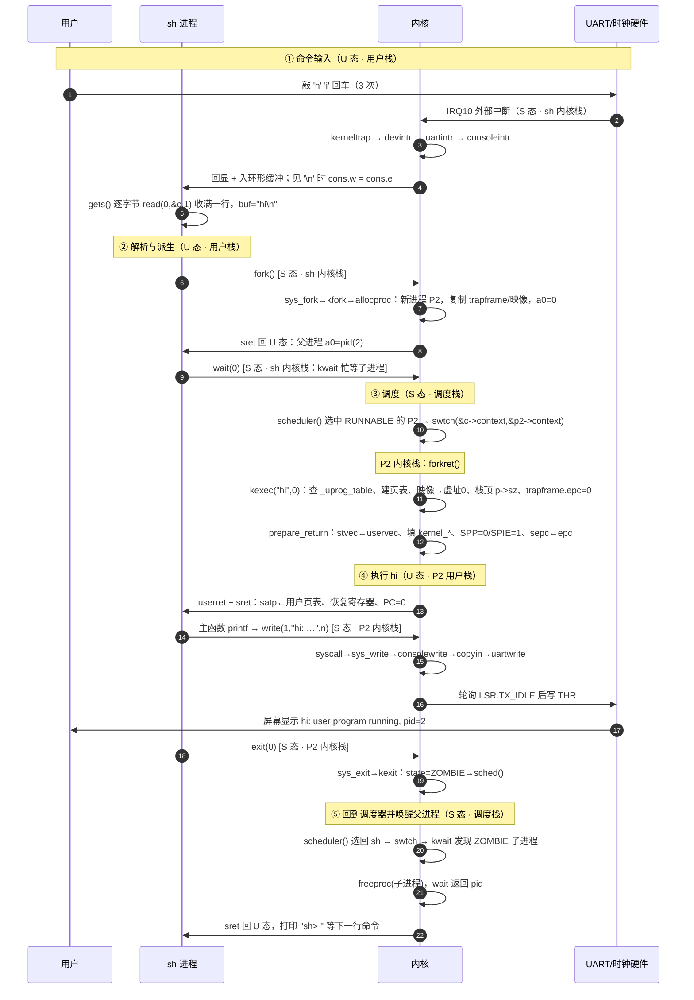
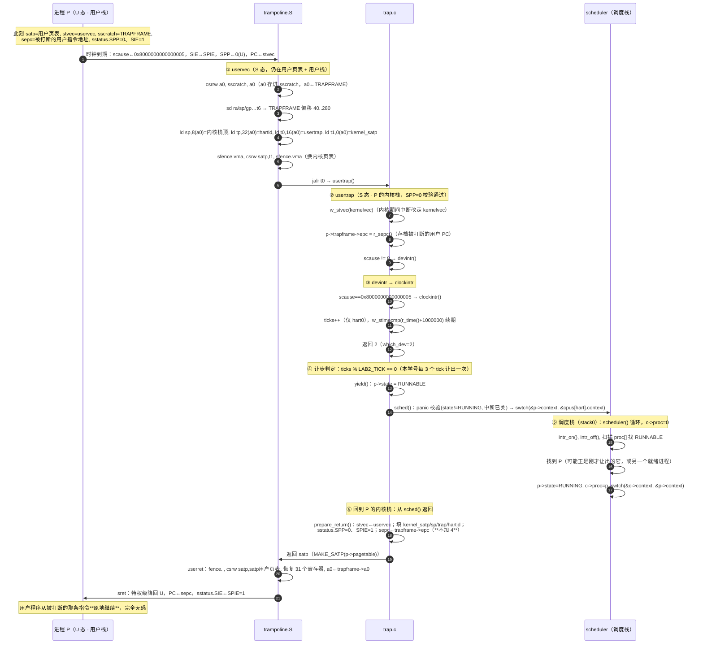

# lab0 设计图纸（控制流图 · 2026–2027 学期）

> 学号 2024302111292 · 图纸对应 lab2 已落地的实现
> 图例约定：**[U]** = 用户态，**[S]** = 监督态，**[M]** = 机器态；每个节点标注运行所在的栈。
> 三张栈：`用户栈` / `内核栈(Px)` = 该进程私有内核栈 `KSTACK(p)` / `调度栈` = hart 0 的 `stack0`（`main()`→`scheduler()` 一直用它）。

---

## 图 1：全系统控制流图（模块级）

**场景**：用户敲下回车，shell 解析出命令 `hi`，装载并运行它，屏幕打出 `hi: user program running, pid=2`，最后回到 `sh>` 提示符。

> 与 lab0 原稿的对应关系：lab0 图上写作 `exec(echo)`、`echo: write(1,"hi")`；本工程 lab2 的等价物是内嵌程序 **`hi`**（`user/hi.c`）——`exec` 的搜索对象是内核里的 `_uprog_table`（lab6 才换成真文件系统），`echo` 这一格由 `hi` 承担，其余链路完全一致。

### 1.1 时序全景



### 1.2 逐节点明细（栈 / 特权级 / 代码位置 / 寄存器）

| # | 阶段 | 栈 | 特权级 | 代码路径与关键动作 |
| --- | --- | --- | --- | --- |
| 1 | 键盘产生中断 | — | M→S | UART 拉高 IRQ10；PLIC 优先级 1 > 阈值 0；`sie.SEIE` 已开 |
| 2 | 中断入口 | **sh 内核栈** | S | 被打断的是 S 态代码（`consoleread` 忙等中），`stvec=kernelvec` → 压 256 B 现场，**不换页表** |
| 3 | 中断分发与入队 | sh 内核栈 | S | `kerneltrap → devintr(scause=0x…9) → plic_claim → uartintr → consoleintr`：回显 + `buf[e++%32]=c`；`\n` 时 `cons.w=cons.e` |
| 4 | 系统调用读一行 | sh 内核栈 | S | `gets()` 循环 `read(0,&c,1)`：`ecall`→`uservec`(换栈/换页表)→`usertrap`→`syscall`→`sys_read`→`consoleread` 取字节→`copyout` |
| 5 | 用户态解析 | **用户栈** | U | `sret` 回 U 态；`buf="hi\n"`（`gets` 保留行尾 `\n`，由内核 `nameeq()` 吃掉尾部空白后再比名字） |
| 6 | `fork` | sh 内核栈 | S | `ecall`→`usertrap`→`sys_fork`→`kfork`：`allocproc`(新内核栈+trapframe+页表)、`uvmcopy` 复制映像、`*(np->trapframe)=*(p->trapframe)`、`np->trapframe->a0=0`、state=RUNNABLE |
| 7 | 父进程等待 | sh 内核栈 | S | 父进程 `a0=pid`，进入 `wait(0)`→`kwait` 忙等（**不让出 CPU**，见 §3 局限说明） |
| 8 | 调度决策 | **调度栈 (stack0)** | S | 时钟中断（见 **图 2**）触发 `yield`：sh 置 RUNNABLE、`swtch` 进 `scheduler()`；此时 P2 早已是 RUNNABLE（`kfork` 里置的），`scheduler` 线性扫描选中它 → `p->state=RUNNING`、`c->proc=p` → `swtch(&c->context,&p2->context)` |
| 9 | 子进程首次进入内核 | **P2 内核栈** | S | P2 的 `context.ra` 在 `allocproc` 里已指向 `forkret`；`forkret()`：`kexec("hi",0)` 按名查表、建页表、映像拷到虚址 0、算用户栈顶 `totalsz`（即 `p->sz`）、`memset(trapframe)`、`epc=0`、`sp=totalsz` |
| 10 | 伪造返回现场 | P2 内核栈 | S | `prepare_return()`：`stvec←uservec`、填 `kernel_satp/sp/trap/hartid`、`sstatus.SPP=0`、`SPIE=1`、`sepc=0` |
| 11 | 降级进用户态 | P2 内核栈→用户栈 | S→U | 调 `userret(satp)`：换 satp、flush TLB、恢复 31 个寄存器、`sret`（PC=0，U 态） |
| 12 | 运行 `hi` 主体 | **P2 用户栈** | U | `printf` → `putc` → `write(1,...,n)`（a7=SYS_write=16，`ecall`） |
| 13 | 系统调用输出 | P2 内核栈 | S | `usertrap`→`syscall`→`sys_write`(fd=1) → `consolewrite` → `copyin` 到内核 `buf[32]` → `uartwrite` 轮询 `LSR.TX_IDLE` 写 `THR` |
| 14 | 屏幕显示 | — | — | UART 移位输出 → **`hi: user program running, pid=2`** |
| 15 | `exit` | P2 内核栈 | S | `ecall`→`sys_exit`→`kexit(0)`：`state=ZOMBIE`、`xstate=0`、`sched()` 永不返回（`panic("zombie exit")` 是护栏） |
| 16 | 回收子进程 | 调度栈→sh 内核栈 | S | `scheduler()` 选回 sh（RUNNABLE）→ `swtch` 回到 `kwait` 循环 → 扫到 ZOMBIE → `copyout` xstate、`freeproc` → 返回 pid |
| 17 | 打印提示符 | 用户栈 | U | `wait` 返回值经 `trapframe->a0` 回到 U 态，循环回 `printf("sh> ")`（prompt 本身也走一次 `write`） |

### 1.3 上下文切换与栈的迁移（tab 对齐）

```
                      U 态 / S 态 交界处                 S 态内部
                    ┌───────────────────┐        ┌────────────────────────┐
T0 用户执行 gets()   │ 用户栈 ▓▓▓▓▓▓▓     │        │                        │
T1 ecall + uservec  │      ↓ 硬件不换栈  │        │                        │
T2 usertrap 以后    │                   │  ───▶  │ sh 内核栈 ▓▓▓▓▓▓▓       │
                    │                   │        │   usertrap/syscall/     │
                    │                   │        │   consoleread(忙等)     │
T3 时钟中断→yield    │                   │        │      ↓ swtch (0.3s)    │
                    │                   │        │ 调度栈 ▓▓▓▓▓ (stack0)   │
                    │                   │        │   scheduler() 挑进程    │
                    │                   │        │      ↓ swtch           │
T4 选中 P2          │                   │        │ P2 内核栈 ▓▓ (forkret)  │
T5 kexec 完毕        │ P2 用户栈 ▓▓▓▓     │  ◀───  │      ↑ userret/sret    │
T6 hi 调 write      │                   │  ───▶  │ P2 内核栈 ▓▓ (sys_write)│
T7 exit → ZOMBIE    │                   │        │ 调度栈 ▓▓ → sh 内核栈    │
T8 sh 继续循环       │ 用户栈 ▓▓▓▓▓      │  ◀───  │      ↑ userret/sret    │
                    └───────────────────┘        └────────────────────────┘
     「用户寄存器只活在 trapframe 里」            「swtch 只搬 ra/sp/s0..s11」
```

---

## 图 2：一次时钟中断的微观旅程

**对象**：正在跑的用户进程 P（这里取 `sh` 在 U 态执行 `gets()` 循环中的一刻）。
**触发**：`stimecmp` 到期（`start()` 的 `timerinit` 武装，此后每次中断都 `w_stimecmp(r_time()+1000000)` 续期，约 0.1 s）。

### 2.1 微观时序（寄存器级）



### 2.2 CSR 状态逐步快照

| 时刻 | 栈 | 特权级 | `scause` | `sepc` | `sstatus.SPP/SIE` | `stvec` | `satp` | `sscratch` |
| --- | --- | --- | --- | --- | --- | --- | --- | --- |
| 被打断前 | 用户栈 | U | — | 用户 PC | 0 / 1 | `uservec` | 用户页表 | TRAPFRAME |
| 中断瞬间（硬件） | 用户栈 | S | `0x8000…0005` | 用户 PC（**原样**） | 0 / 0（SIE 存入 SPIE） | `uservec` | 用户页表 | TRAPFRAME |
| `uservec` 保存中 | 用户栈 | S | 同上 | 同上 | 同上 | `uservec` | 用户页表 | 换出后的用户 a0 |
| `uservec` 切栈后 | **P 内核栈** | S | 同上 | 同上 | 同上 | `uservec` | **内核页表** | 用户 a0 |
| `usertrap` 开头 | P 内核栈 | S | 同上 | 同上 | 同上 | **`kernelvec`** | 内核页表 | 用户 a0 |
| `clockintr` 内 | P 内核栈 | S | 同上 | 同上 | 同上 | `kernelvec` | 内核页表 | 用户 a0 |
| `yield`/`swtch` 前后 | 内核栈→调度栈→内核栈 | S | 同上 | 同上 | 同上 | `kernelvec` | 内核页表 | 用户 a0 |
| `prepare_return` 后 | P 内核栈 | S | 同上 | **`trapframe->epc`（原值）** | **0 / 1** | **`uservec`** | 内核页表 | 用户 a0 |
| `sret` 之后 | 用户栈 | U | 同上 | 用户 PC | 0 / 1 | `uservec` | **用户页表** | TRAPFRAME |

> `sscratch` 在 `userret` 里没有恢复：它保持"用户 a0"，等下一次陷入时 `csrrw` 再换回来——这正是下一轮 `uservec` 能立刻拿到 TRAPFRAME 的原因。

### 2.3 让步与调度决策（本学号的量化细节）

| 项 | 值 / 依据 |
| --- | --- |
| 时钟周期 | `w_stimecmp(r_time() + 1000000)` ≈ 0.1 s 一次（`clockintr`） |
| tick 计账 | 仅 `cpuid()==0` 自增 `ticks`（单核运行，等价于全局计数） |
| 让步粒度 | `ticks % LAB2_TICK == 0` → 本学号 `LAB2_TICK=3`，即**每 3 次时钟中断（约 0.3 s）让出一次** |
| 让步动作 | `yield()`：`p->state = RUNNABLE` → `sched()` → `swtch(&p->context, &cpus[hart].context)` |
| 保存内容 | `p->context`：`ra,sp,s0..s11`（`swtch.S`，只保存被调用者保存寄存器） |
| 调度策略 | `scheduler()` 从 `proc[0..NPROC-1]` **线性扫描第一个 RUNNABLE**，无优先级、无时间片队列（lab4 换 MLFQ/步长） |
| 无就绪进程时 | `found==0` → `wfi` 等下一次中断（省电，且不会忙转） |
| 关键不变量 | `swtch` 前后 `satp` 都指向**内核页表**——进程私有的用户页表只在 `uservec`(装入) 与 `userret`(换回) 两处切换，所以内核栈上的代码不必关心当前是谁在跑 |

### 2.4 另一条并行的路径：中断落在 S 态内核代码里

若时钟中断到来时 CPU 正跑在内核态（例如 `sh` 阻塞在 `sys_read → consoleread` 的空缓冲忙等里、或 `kwait` 忙等里），入口完全不同：

| | U 态被打断（本图主线） | S 态内核代码被打断 |
| --- | --- | --- |
| 入口 | `uservec`（换栈 + 换页表 + 存 trapframe） | `kernelvec`（只压 256 B 寄存器现场，**不换栈不换页表**） |
| C 处理 | `usertrap()` | `kerneltrap()` |
| 校验 | `sstatus.SPP == 0`（非 U 态即 panic） | `sstatus.SPP == 1` 且 `intr_get()==0`（否则 panic） |
| 让步条件 | `which_dev==2 && ticks % LAB2_TICK == 0` | 同上，**且 `myproc() != 0`**（调度器上下文里不让步） |
| `sepc` 处理 | 由 `trapframe->epc` 保管，`userret` 前写回 `sepc` | 进入时把 `sepc/sstatus` 存进**局部变量**，`yield()` 回来后 `w_sepc/w_sstatus` **原样恢复**（防止让步期间嵌套陷阱改坏它们） |
| 返回 | `prepare_return` → `userret` → `sret` 降回 U 态（`sret` 同时把 `sstatus.SIE` 从 SPIE 恢复） | `kernelvec` 直接 `sret` 回到内核代码，同样由 `sret` 把 SIE 从 SPIE 恢复 |

> 两张图合起来的结论：**"用户态 ↔ 内核态"的边界只由 `trampoline.S` 一处跨越**，而"进程 ↔ 进程"的边界只由 `swtch.S` 一处跨越；lab2 的所有功能（系统调用、键盘输入、shell 派生与回收）都是这两条边界组合出来的。
