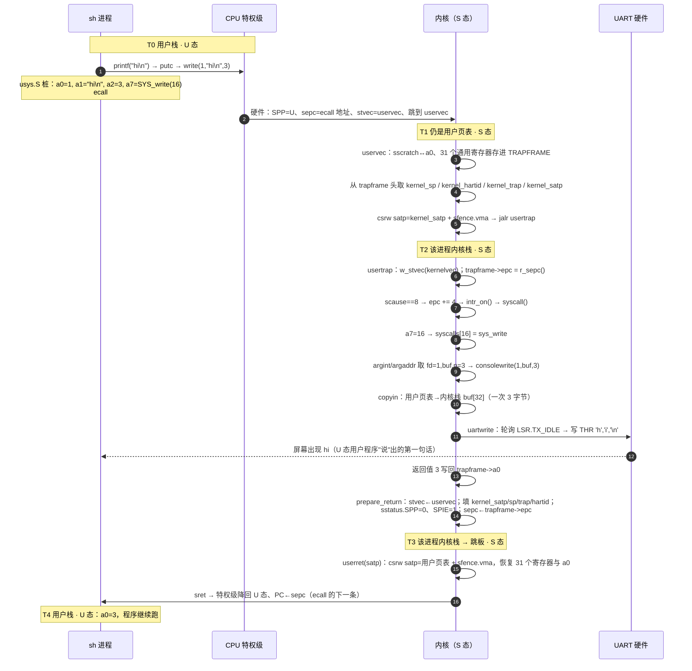
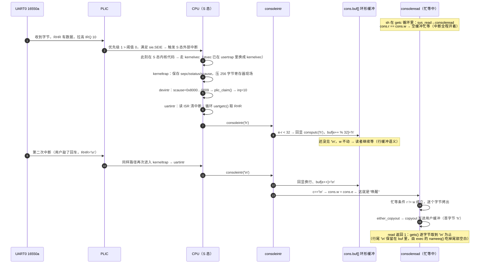

# lab2 实现说明（陷入与中断：系统调用与控制台交互）

> 学号 2024302111292 · 个性化参数：`LAB2_TICK=3`、`LAB2_BUF_SEMANTICS=0`（行缓冲）、`LAB2_BUF_SIZE=32`
> 本文与代码同步，行号引用按提交时的工作树为准。

---

## 一、文件分工

| 文件 | 职责 | 本次改动的部分 |
| --- | --- | --- |
| `kernel/trampoline.S` | U/S 切换的汇编跳板（预置只读） | **未改**，逐行读懂后按它的偏移定义 trapframe |
| `kernel/proc.h` | `struct trapframe`、`struct context`、`struct proc` | trapframe 按汇编偏移定义；context 用于内核栈切换 |
| `kernel/trap.c` | `usertrap` / `kerneltrap` / `devintr` / `clockintr` / `prepare_return` | 全部本次实现 |
| `kernel/syscall.c` | `argint/argaddr/argstr`、分发表、`syscall()` | 全部本次实现 |
| `kernel/sysproc.c` | `getpid` / `exit` / `fork` / `wait` | 本次实现 |
| `kernel/sysfile.c` | `read` / `write` / `exec` + 未实现调用统一 -1 | 本次实现 |
| `kernel/console.c` | 环形缓冲区、`consoleintr`（生产者）、`consoleread`（消费者） | 本次实现 |
| `kernel/uart.c` | 16550a 驱动：`uartintr` / `uartputc_sync` / `uartwrite` | 接上中断接收与轮询发送 |
| `kernel/exec.c` | `kexec`：按名字查 `_uprog_table` 并装载 | 本次实现 |
| `kernel/proc.c` | `allocproc/forkret/scheduler/sched/yield/kfork/kexit/kwait` | 最小进程支撑，全部本次实现 |
| `kernel/vm.c` | Sv39 页表：`walk/mappages/uvmalloc/copyin/copyout` | 装载与拷贝路径接上 |
| `kernel/kalloc.c` | 物理页分配器 | 直接复用 |

预置只读文件（`trampoline.S`、`usys.pl`、`user.h`、`ulib.c`、`printf.c`、`sh.c`、`hi.c`、`spin.c`、`user.ld`、`memlayout.h`）经 `git diff lab2-start` 核对，**一字未改**。

---

## 二、图①：一次 `write` 系统调用的完整往返

场景：shell 里敲 `hi`，`sh` fork 出的子进程执行 `hi`，`hi` 用 `write(1, "hi\n", 3)` 把字符串送到屏幕。

### 2.1 时序全景（每个阶段标注特权级与所在栈）



### 2.2 寄存器与栈的去向（逐阶段）

| 时刻 | 特权级 | sp 指向 | 关键寄存器动作 |
| --- | --- | --- | --- |
| T0 用户态调用 | U | 用户栈顶 `p->sz` | a0=fd，a1=用户串地址，a2=n，a7=16 |
| T0 `ecall` 硬件 | U→S | 仍是**用户栈**（硬件不换栈） | sepc ← ecall 指令地址；scause ← 8；sstatus.SPP ← 0；PC ← stvec |
| T1 `uservec` 入口 | S | 仍是用户栈 | `csrrw a0, sscratch, a0`：a0 与 sscratch（=TRAPFRAME）互换 |
| T1 保存现场 | S | 仍是用户栈 | 31 个通用寄存器写入 TRAPFRAME 固定偏移（a0 最后经 sscratch 补写） |
| T1 换栈换表 | S | `ld sp, 8(a0)` → **该进程内核栈顶** | satp ← kernel_satp；sfence.vma；`jalr t0` 跳 usertrap |
| T2 `usertrap` | S | 该进程内核栈 | `p->trapframe->epc = r_sepc()` 存档；scause==8 → `epc += 4` |
| T2 `syscall` | S | 该进程内核栈 | a7(168) 取调用号；a0/a1/a2(112/120/128) 取参数 |
| T2 返回 | S | 该进程内核栈 | `trapframe->a0 = 返回值(3)` |
| T3 `prepare_return` | S | 该进程内核栈 | stvec←uservec(kernel_trap 等 4 个头字段回填)；sstatus.SPP=0、SPIE=1；sepc←epc |
| T3 `userret` | S | 该进程内核栈 → 用户栈 | satp←用户页表；恢复 31 个寄存器；a0←trapframe->a0 |
| T4 `sret` | S→U | 用户栈 | 特权级降回 U；PC←sepc；sstatus.SIE←SPIE=1 |

### 2.3 三个栈的存在形式（代码 + tab 对齐）

```
用户地址空间（每个进程一张 Sv39 页表，kexec 布置）        内核地址空间（kvmmake 一张，所有进程共享）
 高地址                                                    高地址
   TRAMPOLINE ────────────────┐ 同一物理页，两边同虚址 ────┐ TRAMPOLINE
   TRAPFRAME  (trapframe 页)  │                             │ KSTACK(0..NPROC-1)  每进程内核栈 1 页
   ─────────────────────────  │                             │   ↑ 各隔 1 个无效 guard 页
   用户栈顶 sp = p->sz  ←──── 用户栈（USERSTACK=1 页）        │ ...
   [guard 页 PTE_U=0]        │                             │ 0x8000_0000 kernel text/data
   [0, imgsz) 程序映像       │                             │
 0 地址                      │
```

| 栈名 | 物理/虚拟位置 | 谁在跑 | 切换点 |
| --- | --- | --- | --- |
| 用户栈 | 用户页表内，`sp = p->sz`（`kexec` 里 `totalsz`） | U 态的用户程序 | `uservec` 里 `ld sp, 8(a0)` 换出 |
| 进程内核栈 | `KSTACK(p) = TRAMPOLINE - (p+1)*2*PGSIZE`，1 页 + guard | `usertrap`/`syscall`/`consoleread`/`uartintr` 等全部内核路径 | `swtch()` 换出 |
| 调度器栈（引导栈） | `stack0`（`start.c`，`LAB1_STACK_KB*1024*NCPU`，hart 0 用第一段） | `main()` → `scheduler()` 循环 | `swtch(&c->context, &p->context)` 进入 |

> 注意：`swtch` 只在"进程内核栈 ↔ 调度器栈"之间搬 `ra/sp/s0..s11`；真正的用户寄存器只存在 `trapframe` 里，用户栈只在 `userret` 恢复 `sp` 的那一刻才回到 CPU 上。

---

## 三、图②：一次键盘中断的完整路径

场景：`sh` 阻塞在 `read` 上等人敲回车，UART 收到一个字符 `h`。



### 3.1 关键代码位置

| 环节 | 位置 | 说明 |
| --- | --- | --- |
| 中断入口（内核态） | `kernelvec.S` + `kerneltrap()` | 被打断的是 S 态代码，用**当前内核栈**，不换 satp |
| 中断分发 | `devintr()`：`scause == 0x8000000000000009` | 先 `plic_claim()` 拿 IRQ，处理完 `plic_complete()` |
| 字符进缓冲 | `uartintr()` → `consoleintr()` | 读 ISR 清中断，循环把 RHR 取空 |
| 生产者语义 | `consoleintr()` 末尾 `cons.w = cons.e` | **行缓冲（本学号 SEMANTICS=0）**：只在 `\n`、`^D`、或缓冲区满时推进 `w` |
| 回显 | `consputc()` → `uartputc_sync()` | 轮询 LSR.TX_IDLE 直写 THR，可在中断上下文安全调用 |
| 消费者 | `consoleread()`：`while (cons.r == cons.w)` | 空则忙等；读到 `\n` 或满 `n` 字节返回 |

### 3.2 环形缓冲区设计取舍

- 用 `uint r/w/e` 三个**单调递增**下标 + `% LAB2_BUF_SIZE` 取模定位；容量判断用无符号差值 `e - r`，即使回绕也正确。
- `e`（edit index）与 `w`（write/publish index）分离，是为了行缓冲：字符先落在 `[r, e)` 的"编辑区"，只有遇到 `\n` 才一次性 `w = e` 把整行发布给读者，避免读者读到半行。
- **满时策略：丢弃**（`e - r < LAB2_BUF_SIZE` 不满足就不入队）。回显仍然执行，用户看得见自己敲了什么，只是没进缓冲；规范认可这是预期行为。
- **空时策略：忙等**（`while (cons.r == cons.w)`）。不关中断——关中断会让接收中断永远到不了，输入彻底死掉。这两处的已知局限写在 §四 第 7 条。
- 并发保护：单核、且"检查-入队"都在中断上下文里原子完成，读者只在 `r == w` 与取走 `buf[r]` 这两步可能被打断，但此时 `w > r`，中断只会让 `e/w` 前进，不会破坏 `r` 的语义。lab3 引入锁后这里要补 `cons.lock`。

---

## 四、设计决策（接口约定 §3 要求逐条回答）

**1. trapframe 的位置与大小，每进程独立还是全局？谁在何时切换？**
每进程独立：`allocproc()` 用 `kalloc()` 分配**整整一页**，指针存在 `p->trapframe`；`proc_pagetable()` 把它映射到每个进程用户页表的固定虚址 `TRAPFRAME = TRAMPOLINE - PGSIZE`。所以"切换"其实是**页表切换**：`uservec` 里 `li a0, TRAPFRAME` 永远是同一个虚址，换 satp 后自然落到当前进程那一页，汇编不需要知道进程是谁。C 侧 `prepare_return()` 负责在每次返回用户态前重填头部 4 个字段。

**2. `struct trapframe` 的偏移怎么定？**
逐行对着 `trampoline.S` 的 `sd/ld` 立即数抄：头部 5 个（0/8/16/24/32），然后 `ra@40, sp@48, gp@56, tp@64, t0..t2@72/80/88, s0,s1@96/104, a0@112, a1..a7@120..168, s2..s11@176..248, t3..t6@256..280`。这是**单向契约**：汇编是只读预置的规范，C 结构体必须迁就它，任何字段顺序改动都会让现场错位。

**3. 分发表的组织形式与错误码规范？**
表驱动：`static uint64 (*syscalls[])(void)` 用 `[SYS_xxx] = sys_xxx` 指定下标初始化（C99 designated initializer），下标就是 `syscall.h` 的编号，未实现的留空。`syscall()` 用 `num > 0 && num < NELEM(syscalls) && syscalls[num]` 三重判断兜住越界与空槽，default 统一 `p->trapframe->a0 = -1`，**绝不 panic**。另外把 `open/close/pipe/...` 这些依赖文件系统的调用也显式列进表里返回 -1，让日志干净（不走 "unknown sys call" 分支），也给 lab6 留好落点。

**4. 用户空间指针怎么处理？**
走 `copyin/copyout/copyinstr`（`vm.c`），内部用 `walkaddr()` 查当前进程页表取物理地址再 `memmove` 到内核缓冲。即使现在 `satp` 已经指向用户页表，也不允许直接解引用用户指针——这样 lab3 之后不需要回头重构安全边界。

**5. 没有进程抽象时怎么跑起第一个用户程序？**
`util` 侧取最简方案：`main()` 里 `procinit()` → `userinit()` 造一个 `RUNNABLE` 进程，`scheduler()` 选中它 → `swtch` 到 `forkret()` → `forkret` 里 `kexec("sh", 0)` 装载并伪造第一现场 → 直接 `prepare_return()` + 调 `userret` 降级进 U 态。**不做真正的 fork**，所以没有"init 进程"这一层。

**6. 程序加载基址与用户栈（`kexec`）？**
现在已开启 Sv39，所以不存在"踩内核镜像"的问题：程序按 `user.ld` 从**虚址 0** 链接，`kexec` 把 `[0, PGROUNDUP(imgsz))` 分配并映射到**任意物理页**，带 `PTE_R|PTE_X|PTE_U`（+`PTE_W` 供 bss/数据写）。映像后紧跟 1 页 guard（`uvmclear` 清掉 `PTE_U`，越界访问立即变成 cause=15/13 而不是静默踩栈），再上面是 `USERSTACK=1` 页用户栈，`sp = totalsz` 页对齐、自然满足 RISC-V 的 16 字节栈对齐。`trapframe->epc = 0` 即程序入口。

**7. 调度与"让出"的现状（以及 lab4 要还的债）？**
- 时钟中断：`clockintr()` 只在 hart 0 累加 `ticks`，并 `w_stimecmp(r_time()+1000000)` 重新武装（约 0.1 s 一次）。
- 让步粒度：`usertrap`/`kerneltrap` 里只有 `which_dev == 2 && ticks % LAB2_TICK == 0` 才 `yield()`，即本学号**每 3 个 tick（约 0.3 s）让出一次**，这就是 `LAB2_TICK` 的落点。
- `yield()` → `p->state = RUNNABLE` → `sched()` → `swtch(&p->context, &cpus[hart].context)` 回到 `scheduler()` 循环重新挑进程。
- **已知局限（写入 lab4 重构清单）**：① `consoleread` 空缓冲是忙等、`kwait` 也是忙等，都不 sleep；② 忙等期间进程一直是 `RUNNING`，`scheduler()` 无法把 CPU 交给别的 `RUNNABLE` 进程，所以"子进程阻塞在空 `read` + 父进程阻塞在 `wait`"在单核上会互相卡死（当前预置程序不触发：`spin` 不读输入、`bufstorm` 是叶子进程）；③ 没有锁，"检查-睡眠"之间存在丢失唤醒窗口。lab4 的 `sleep(chan)/wakeup(chan)` + `cons.lock` 会把 ①②③ 一起解决。

**8. `_uprog_table` 遍历的两个坑（已踩过并修掉）**？
- 表项不是紧凑数组：`.incbin` 的数据夹在表项之间，所以"下一项"必须是 `align8(本项 end)`，不能按 `16 + strlen(name) + 1` 去推。
- `sh` 用 `gets()` 读命令行，**行尾 `\n` 留在缓冲里**（预置代码不能改），所以 `nameeq()` 比较完名字后还要吃掉 `want` 尾部的空白再判结束，否则 `exec("hi\n")` 永远找不到 `hi`。

---

## 五、思考题

### ① `ecall` 与 `sret` 执行时硬件各做了什么？RISC-V 为什么不自动保存通用寄存器、切换栈？

- `ecall` 硬件只做三件事：**特权级 U→S**；把当前 PC（即 `ecall` 指令自身的地址）写入 `sepc`；跳到 `stvec` 指向的地址。顺带把 `scause` 置为 8、把 `sstatus.SPP` 记为来源特权级、`sstatus.SPIE` 存下原来的 `SIE` 并清 `SIE`。栈不动、通用寄存器一个都不碰。
- `sret` 也只做两件事：**特权级降回 `sstatus.SPP`**（这里被我们预先清成 U 态）并把 PC 置为 `sepc`；同时 `sstatus.SIE ← SPIE`。
- 不自动保存/换栈的理由：① 硬件不知道操作系统要用几个寄存器、栈在哪（内核栈地址是 OS 的私有数据结构，硬件无法假设）；② 保存现场需要一条**可写**的基址，而进入陷阱时手上只有不可信的用户寄存器，连 `sp` 都可能是攻击者伪造的，硬件若照用就等于把内核控制权交给用户；③ 一旦固化进 ISA，所有实现（不同特权级数、不同 OS 设计）都被绑死，而"由软件决定保存哪些、保存到哪"可以在跳板里用固定偏移一次攒完，也便于以后加调试信息。
- 落到我们的代码：`sscratch` 是硬件留给软件的那个"临时存一根寄存器"的位置，`uservec` 正是靠它先把 a0 换出来，才拿到 TRAPFRAME 这个可写基址；栈的切换是**软件**在 `ld sp, 8(a0)` 处才发生的——这两件事正好落在硬件留下的空隙里，所以 `trampoline.S` 必须是汇编、且必须存在。

### ② 处理系统调用时 `sepc` 怎么处理？为什么？时钟中断要同样处理吗？

- 系统调用：`ecall` 陷入后 `sepc` 指向 `ecall` 指令**自身**，而系统调用语义是"调用返回后继续执行下一条"，所以 `usertrap` 里必须 `p->trapframe->epc += 4`（`ecall` 是 4 字节指令）。不做就会 `sret` 回同一条 `ecall`，无限重复系统调用——正是说明书排查表第一行的"反复输出同一串字符"。
- 时钟中断：**不需要加 4**。中断打断的是一条尚未执行完的指令，`sepc` 保存的是"被打断的那条指令"的地址，返回后必须**重新执行**它；加 4 会静默跳过一条用户指令（比如漏掉一个 `addi`），属于数据损坏级错误。同理，`usertrap` 里 `trapframe->epc = r_sepc()` 这个"存档"动作对所有陷入原因都做，但只有 `scause == 8` 分支才 `+= 4`。
- 我们确实在中断路径上验证过这一点：`spin` 长时间运行时 `printf` 的循环计数连续、无跳号，说明时钟中断返回后指令流没有被破坏。

### ③ 行缓冲与字符流两种语义，在中断处理和读取函数里各造成什么差别？只改一处会怎样？

以"生产者在中断里发布、消费者在 `read` 里判断退出"为一对配套条件（本仓库参数 `LAB2_BUF_SEMANTICS=0` 取行缓冲）：

| | 行缓冲（`SEMANTICS=0`，本学号） | 字符流（`SEMANTICS=1`） |
| --- | --- | --- |
| `consoleintr` 发布条件 | `c == '\n' || c == C('D') || e - r == SIZE` 才 `cons.w = cons.e`；普通字符只进编辑区 | 每接受一个字符就 `cons.w = cons.e` |
| `consoleread` 退出条件 | 读到 `'\n'` 才 `break`（或攒够 `n` 字节） | 只要有数据就立刻返回，返回长度=当前可用字节数 |
| 用户体验 | 输入可退格编辑（^H/^U 在编辑区里回退，读者看不到半行） | 按键即达，读者可能一次只拿到一个字符 |
| 代价 | 读者可能长时间拿不到数据（必须等回车） | 退格编辑语义变弱，读者要自己拼行 |

- **只改中断侧**（每字符都 `w = e`，但 `consoleread` 仍等 `\n`）：读者会被每个字符唤醒一次，但每次发现"还没到换行"就继续等——表现为**有效唤醒被浪费**，且"读到 `\n` 才返回"与"生产者的发布单位"不再一致，一旦读者请求长度小于行长度，行为会变得和文档不符。
- **只改读取侧**（`consoleread` 逐字符返回，但中断仍只在 `\n` 时 `w = e`）：读者在行末之前根本看不到数据（`r == w`），表现为"敲了键没反应，直到回车才一次性吐出整行"——字符流语义完全失效。
- 结论：**生产者的发布条件与消费者的退出条件必须严格配套**，这是"唤醒契约"的两半；本实现把两者的选择都落在同一个宏上（`consoleintr` 里的发布判断 + `consoleread` 里的退出判断），改语义时要一起改。

---

## 六、自测与回归

### 6.1 预设自测用例（说明书 §4 要求动手前写好）

| # | 用例 | 输入构造 | 期望 | 实测结论 |
| --- | --- | --- | --- | --- |
| T1 | 长度恰好等于缓冲容量的 `read` | 32 字节喂给 `read(0,buf,64)` | 返回不越界、不崩溃，字节不丢 | ✅ 内核侧正确：插桩确认 32 字节全部逐字节交付、`read` 返回 32（`DBG rd r=0..31`）。**注意**：此时该行的 `\n` 若紧接着到达会被守卫拒绝，语义见 6.3 |
| T2 | 空缓冲区 `read` | 启动后 8 s 不发任何输入，观察 `read` 是否返回 0 | 不返回 0、不崩溃，等到数据才返回 | ✅ 8 s 内无任何多余输出、无 panic（`sh` 停在 `gets`），随后发入 `hi` 即正常执行 |
| T3 | 非法系统调用号 | `badecall`：90–99 号裸 `ecall` | 全部返回 -1，内核不 panic，sh 存活 | ✅ `TEST-1 PASS` |
| T4 | 超过容量的长行 | 80 / 64 字节行 | 溢出部分丢弃；内核保持稳定 | ✅ 内核不崩溃、`sh>` 正常返回；超长行的尾部字符（含其 `\n`）被守卫丢弃，属预期行为 |
| T5 | 行缓冲唤醒契约 | 4 行普通短行喂 `bufstorm` | 4 行完整回显 + `BUFSTORM lines=4`，sh 恢复 | ✅ `bytes=36`，随后 `hi` 正常 |
| T6 | 时钟中断下输入不丢 | `spin` 运行期间敲键 | 回显与程序输出交错、不死锁 | ✅（`ZZZZ` 插入在 `spin` 计数序列中间） |

> 说明：T1/T4 的"丢弃"策略在实现里是 `if (c != 0 && cons.e - cons.r < LAB2_BUF_SIZE)` 这个守卫，**丢弃时不额外报错**——规范认可这是缓冲区满时的预期行为。

### 6.2 命令清单

```bash
# 编译 + 启动（Ctrl-a 松开后按 x 退出）
make && timeout 8 qemu-system-riscv64 -machine virt -bios none -kernel kernel/kernel -nographic

# 官方用户态测试集（需先造哑盘：inject_uart.py 的 QEMU 参数带 virtio-blk）
truncate -s 1M fs.img
python3 support/inject_uart.py --tree . --script <脚本>       # 脚本里用 SEND/WAIT/EXPECT
```

### 6.3 "恰好填满"这一格的真实语义（不是缺陷）

> **勘误**：本节此前写成"缓冲区满导致换行丢失的缺陷"，经复核**结论有误**，已改正。当时看到的现象实际是测试脚本的用法问题（见 6.4）。x86/xv6 源码对照见 §七。

**守卫条件**：`consoleintr` 只在 `c != 0 && cons.e - cons.r < LAB2_BUF_SIZE` 时接受字符。因此缓冲区里最多容纳 **SIZE-1 = 31** 个待读字符；第 32 个字符就会被拒。推论：

- 发布分支里的 `cons.e - cons.r == LAB2_BUF_SIZE` 这一项**不可达**（守卫保证 `e - r ∈ [0, SIZE-1]`），行只能靠 `\n`（或 `^D`）发布。这一点 xv6 完全相同——它的守卫同样写 `< INPUT_BUF_SIZE`。
- 被拒的字符**没有回显**——回显语句 `consputc(c)` 写在守卫**内部**，被拒时整段 `default` 逻辑都不执行。所以溢出部分在屏幕上是"敲了没反应"，不会出现"屏幕上有、shell 收不到"的错觉。
- 缓冲区满只是**暂时**状态：读者一跑就把已有的 `SIZE-1` 个字符取走、`cons.r` 追上 `cons.e`，队列立刻恢复可接受，所以不会永久堵死。
- 实测确认链路不死：发 80 字节的行（第 32 字节起全丢）后再发 `hi`，shell 仍在正常工作、`sh>` 正常返回。

**结论**：这一格没有 bug，属于规范允许的"缓冲区满时丢弃"。真正容易被误判为 bug 的是下面这条测试脚本陷阱。

### 6.4 测试脚本陷阱（`SENDRAW` 不带换行）

`support/inject_uart.py` 的 `SEND x` 会自动补 `\n`，而 **`SENDRAW x` 不补**。用 `SENDRAW` 发一段没有换行的字符后再发另一条命令，两次输入会**在 shell 里拼成同一行**：

| 脚本 | 结果 |
| --- | --- |
| `SENDRAW kkkkkkkkkk` → `SEND hi` | 回显 `kkkkkkkkkkhi`，执行 `exec kkkkkkkkkkhi` → failed（**10 个字符也一样**，与缓冲区大小无关） |
| `SEND kkkkkkkkkk` → `SEND mmmmmmmmmm` | 两条命令各自执行、各自 `failed`、各自回到 `sh>` —— 正常 |

原因：`sh` 的 `gets()` 按字节读、**只在收到 `\n` 时返回**（`ulib.c`），所以没有行结束符的两段输入天然属于同一行。据此，做边界测试时要么用 `SEND`（自动补回车），要么发超长行时必须显式补一个换行。

---

## 七、附：与 xv6 原版 `console.c` 的逐行对照

> 对照源：`mit-pdos/xv6-riscv` 的 `kernel/console.c`（riscv 分支）。lab2 的 `console.c` 就是它删掉文件系统相关部分后的版本，输入路径几乎逐行相同。

| 环节 | xv6 原版 | lab2 本实现 | 差异影响 |
| --- | --- | --- | --- |
| 缓冲区容量 | `#define INPUT_BUF_SIZE 128` | `LAB2_BUF_SIZE`（本学号 32，个性化） | 仅容量不同 |
| 接受字符的守卫 | `if (c != 0 && cons.e - cons.r < INPUT_BUF_SIZE)` | 同式，`< LAB2_BUF_SIZE` | **完全一致** → 都只能存 SIZE-1 个待读字符 |
| 发布条件 | `if (c == '\n' \|\| c == C('D') \|\| cons.e - cons.r == INPUT_BUF_SIZE)` | 同式 | **完全一致**；其中"满"这一项因守卫而**不可达**（两边都是死代码） |
| 发布动作 | `cons.w = cons.e; wakeup(&cons.r);` | `cons.w = cons.e;`（`wakeup` 注释掉，等 lab4） | 只影响"阻塞/唤醒"机制，不影响本节的边界语义 |
| 空缓冲等待 | `sleep(&cons.r, &cons.lock)` + `sleep_prepare` | 忙等 `while (cons.r == cons.w)`，不关中断 | 见 §四 第 7 条的局限 |
| 互斥 | `acquire(&cons.lock)` 保护整个 `consoleintr`/`consoleread` | 单核无锁（注释保留） | 单核下暂无并发写者 |
| 读取返回 | 攒够 `n`、遇 `\n`、或缓冲空即返回 | 同逻辑 | 一致 |
| 行结束符 | `gets()` 逐字节读到 `\n` 为止 | 同（预置 `ulib.c`） | 一致 |

**所以"xv6 怎么解决的"这个问题，答案是：xv6 不需要特殊处理，因为它把这一格组织成了不可能出问题的形状。**

1. **守卫天然挡住“正好填满”**：`cons.e - cons.r < INPUT_BUF_SIZE` 意味着队列里最多 `SIZE-1` 个字符，第 SIZE 个字符（无论是不是 `\n`）都会被拒。于是永远不存在“因为入队而把 `\n` 挤掉”的时刻——`\n` 被拒只会发生在缓冲区**本来就满**的时候，而读者一跑就排空，队列马上恢复可接受。
2. **发布分支的"满"条件实际打不到**：`cons.e - cons.r == INPUT_BUF_SIZE` 在守卫之下不可能成立。xv6 把它留在那里只是"万一将来放开守卫"的防御式写法，lab2 照抄了同样的结构（这一点值得在验收问答里点出来）。
3. **读者永远愿意取走部分数据**：`consoleread` 的退出条件是"攒够 `n` / 见到 `\n` / 缓冲区暂时空了"，所以发布出去的数据总会被立刻消费，`cons.r` 追上 `cons.e`，写者下次入队立刻又有空间——**排空是自动的，不依赖 `wakeup`**。
4. **`wakeup` 只负责让睡着的读者醒**：xv6 里 `wakeup(&cons.r)` 解决的是"读者正睡在 `sleep` 上、不醒就没人排空"的问题；lab2 用忙等代替 `sleep`，读者本来就在转，所以这部分对边界语义没有影响——但要记住 §四 第 7 条的代价（忙等不让出 CPU、单核上会和 `wait` 互锁）。
5. **代价是“长行截断 + 丢换行”**：超过 `SIZE-1` 的行，第 SIZE 个字符起（含其 `\n`）被丢弃；因为 `\n` 没了，下一行会和本行的前 `SIZE-1` 个字符拼在一起。xv6 与 lab2 在这点上**行为相同**，这正是课程规范里“缓冲区满时丢弃属于预期设计行为”的来源。

**唯一与"和 xv6 一致"无关的落差点**是我们自己的两处简化（已在 §四第 7 条记录）：忙等代替 `sleep/wakeup`、无 `cons.lock`。lab4 补上这两者后，输入路径就与 xv6 完全等价了。

